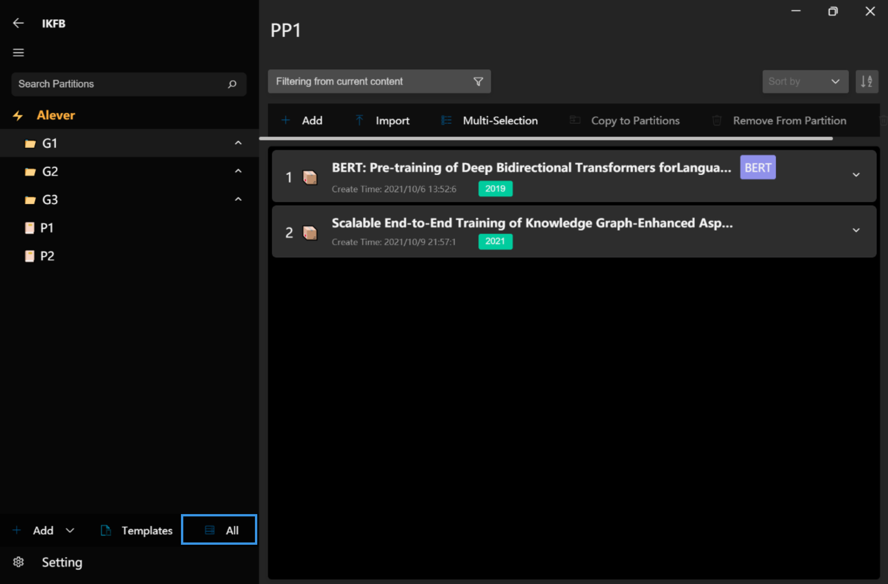
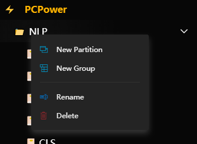
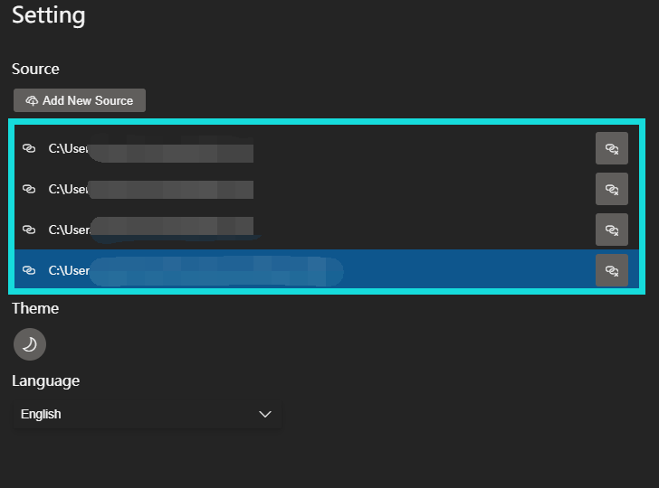
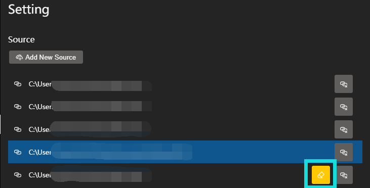

<div align="center">
    
    <p>IKFB</p>
    <p></p>
    <p>
</div>

<p align="center">
    <a href="LICENSE">
      
    </a>
</p>

# IKFB

Involution King Fun Book (IKFB, Chinese: 卷王快乐本) is an integrated management system for papers and literature. The UI design is based on the [VFluent](https://github.com/aleversn/VFluent), which is inspired by the Microsft [Fluent Design System](https://developer.microsoft.com/en-us/fluentui#/). 

The Application is **Cross Platform** and powered by Electron.

> This project is still working on, we are welcome you to be a contributor. 😄

[中文文档(Chinese)](./doc/Chinese.md)

### 🤔 Why we need IKFB?

The **IKFB** aims to provide a complete article management and well-performanced notion user experience. We provide automatic retrieval of literature metadata, and our notebook supports rich text edition and even markdown typing (like typroa).

### 📍 Usage

**Installation**

From the releases page, choose the lateset stable version and download the `.zip` file. Then unzip the file and choose the file named like `ikfb_Setup_xxx.exe` to setup the **IKFB**.

**First time useage**


For the first time to start up, there is a user guide page. And don't worry, just follow the guide page step by step, it's easy and quick to finish the set up. Just click the `Start` button to move on.

In this step, you're going to add a new data source. And you need to choose folder to create the new data source folder.
> A data source is a physical folder to store all the files, and the database would be store in the `data_structure.json` file. Of course, you don't need to be concerned about what's in the folder, and I don't suggest you change the files in the folder, just ignore it, everything is work fine by **IKFB**😊.

Or, if you already have a data source folder and you want to link to it, you can click the `Exists Data Source` button to switch the mode.


And you can select the exists data source root folder to link it. Make sure the folder is the one contains `root/` folder and `data_structure.json`.


When you're ready, just click `Confirm` to finish setup.

**Articles Management**



- All your articles can be found in the `All` page, you can add new `Partition` to collect your domain specific articles. And you can also add new `Group` to collect multiple `Partitions`.



- The root `Partition` or `Group` can be add by the below `Add` button. The group `Partitions` can be create by right click the current `Group`.

> You should be known that the `Group` can't directly contain the articles, it is just a collection of `Partition`. You can create groups nested, however, the **IKFB** database is constructed based on a lightwight database. Therefore nesting too deeply may cause performance decrease.

**Add Articles**

- You can click the `Import` button to import articles in each `Partition` page. **IKFB** would automatically create an `Item` for each article.

- You can even drag the `pdf` files into the application, the function is the same as `Import`.


- Each `Item` contains the article `pdf` file, `metadata` file, and `Note Pages`.

- You can manaully add a new `Item` by click `Add` button, if sometimes you don't wanna add a article but only want to write something on the `Note Page`, you can use this method.

> The article title extraction is implemented by two methods, one is the `pdf` file metadata extraction. However, some journal articles may contain full metadata, but most files don't contain any information. 
The other method is implemented by sorting the `font size` and `position` of first page to extract the title.
The title extraction accuracy is acceptable, and if anyone has a better idea, we are welcome you to be a contributor. 😊

> The article metadata extraction is powered by the **CrossRef** API, there are still many articles can't be retrieved for metadata, if you have better free sources please let us know.

**Note Page**

Our notebook editor is implemented with the [PowerEditor](https://github.com/Creator-SN/PowerEditor), which is powered by [tiptap](https://tiptap.dev/).

It's exciting to show that our editor support rich text editing, and **Markdown Shortcuts**. The extension function of our editor can be displayed as follows:


- Font Style (Bold, Italic, Strike, Underline)
- Block Quote
- Horizontal Rule
- Header
- **To-do Task List**
- Order List
- Text Align
- Text Color
- Text Highlight
- **Drawing Block**
- Emoji
- Code
- **Inline Equation**
- **Block Equation**
- Image
- Link
- Embed

**Data Source Recover**

If you want to add some new data sources or recover your data source in a new device, just follow the below steps:



1. Click the `Setting` button to enter the **Setting** page.

2. In the **Source** block, click `Add New Source` button to link to a existing souce.

3. Please make sure the data source folder is the one contains a `data_structure.json` file and a `root/` folder.



4. If you choose the wrong folder without `data_structure.json`, there will appear a **yellow** button to warn you that there is no `data_structure.json`. 

    > If you mistake the right folder position, just remove this source and choose the right folder again, do not click the **yellow** button !!!

5. If you want to add a new empty source, please create an empty folder for the data source and choose this folder. Then click the **yellow** button to init a new data source.

6. You can switch the current data source by clicking each item of the source list.

### 🛠 Project setup

```
npm install
```

or

```
yarn
```

#### Compiles and hot-reloads for development

```
npm run electron:serve
```

```
yarn electron:serve
```

#### Compiles and minifies for production
```
npm run build
```

or

```
yarn build
```

#### Lints and fixes files
```
npm run lint
```

or

```
yarn lint
```

### 📚 Doc

#### File Structure

- Config
    * config.json

- Data Structure
    * root/
        * ikfb_files/
            * items[i]
                * *.pdf
                * *.ipcnb
        * data_structure.json

#### Data Structure

**Init Function**

1. load_ds_file

    ```javascript
    load_ds_file(data_path=[])
    => {
        status,
        db_array: [{
            status,
            db
        }]
    }
    ```
    - status: 
        - `200`: success.
        - `404`: data_path is empty.
        - `500`: source url not found.
        - `502`: data_structure.json not found.
    - db_array: A array of each source object, each object contains the current ds' db and status.
    - db: A data_structure's lowdb DataStore.

2. init_ds

    ```javascript
    init_ds(id, name, ds_db)
    => default
    ```

### License

GPL 3 License

Copyright (c) 2021 Creator SN®