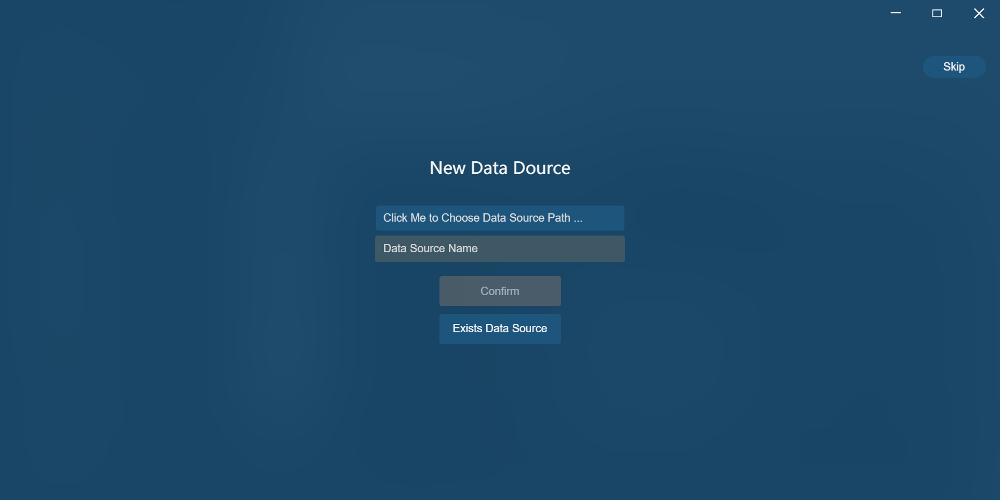
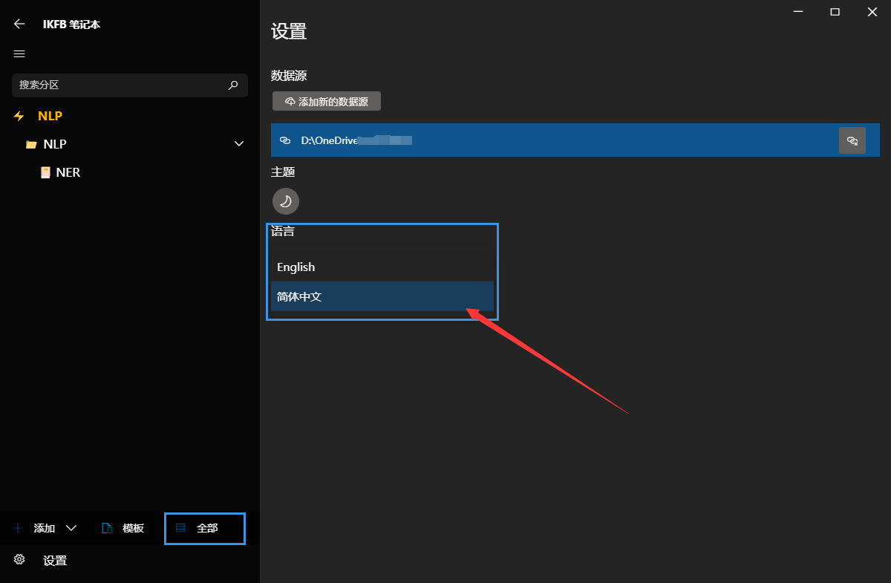
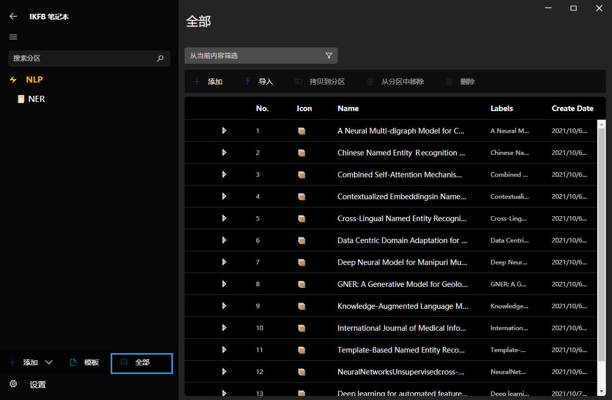
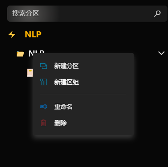
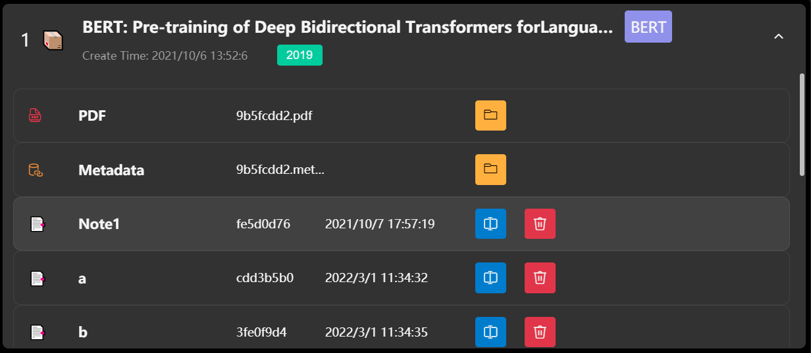
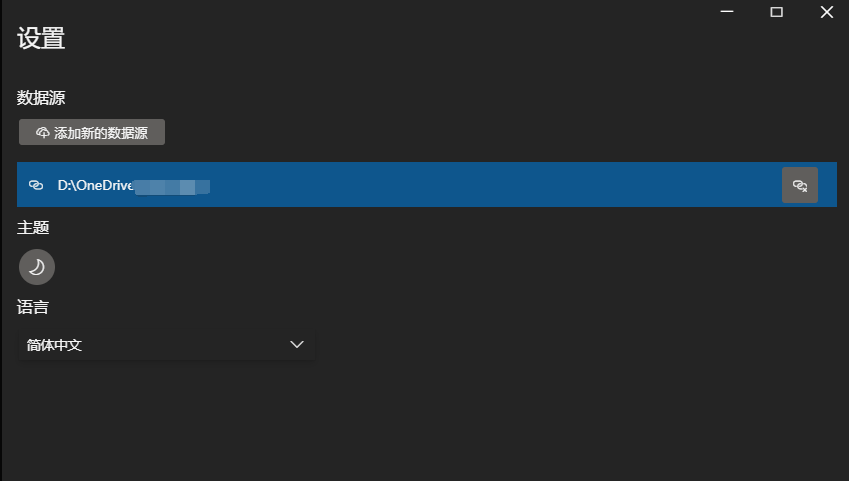
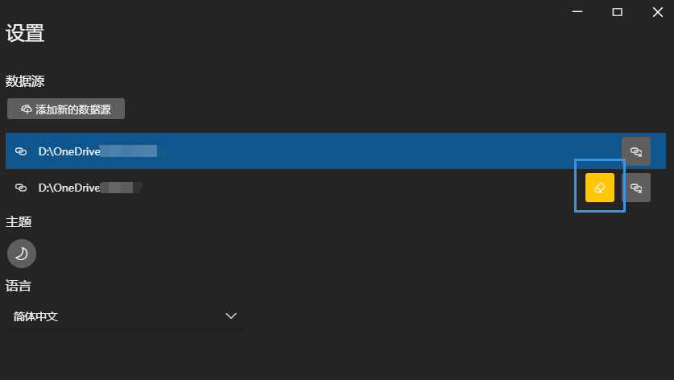

# IKFB 卷王快乐本

IKFB 卷王快乐本（英文：Involution King Fun Book，简称：IKFB）是论文和文献的综合管理系统。 UI 设计基于[VFluent](https://github.com/aleversn/VFluent)，其灵感来自 Microsft [Fluent Design System](https://developer.microsoft.com/en-us/fluentui#/)。

该应用程序支持**跨平台**，由 Electron 提供支持。

> 该项目仍在进行中，我们欢迎您成为贡献者。 😄

### 🤔 我们为什么需要卷王快乐本?

**IKFB**旨在提供完整的文章管理和性能良好的用户体验。我们提供文献元数据的自动检索，我们的笔记功能支持丰富的文本编辑以及Markdown 编辑（如 typroa）。

### 📍 使用

**安装**

从发布页面，选择最新的稳定版本并下载 `.zip` 文件。 然后解压文件并选择命名为 `ikfb_Setup_xxx.exe`的文件来安装**IKFB**。

**第一次使用**

首次启动时，有一个用户指南页面。 不用担心，只需按照指南一步一步来，即可轻松快捷地完成设置。 只需单击`Start` 按钮即可继续。

在此步骤中，您将添加一个新数据源。 您需要选择文件夹来创建新的数据源文件夹

> 数据源是存储所有文件的物理文件夹，数据库将存储在`data_structure.json` 文件中。 当然，你不需要关心文件夹里有什么，我也不建议你更改文件夹里的文件，忽略它，**IKFB**一切正常😊。

或者，如果您已经有一个数据源文件夹，并且希望链接到该文件夹，则可以单击`Exists Data Source`按钮切换模式。

您可以选择现有的数据源根文件夹来链接它。确保该文件夹包含 `root/` 文件夹和`data_structure.json`。

准备好后，只需单击 `Confirm` 即可完成安装。

您可以点击`Setting`进入设置页面，将IKFB的`语言`更改为简体中文

**文献管理**

- 您的所有文章都可以在`全部`页面中找到，您可以添加新 `分区`来收集特定于域的文章。您还可以添加新`组`以收集多个`分区 `。

- 可以通过根目录下面的`添加` 按钮添加`分区 `或`区组` 。右键单击当前组可以创建组分区。

> 您应该知道，`区组`不能直接包含文章，它只是`分区`的集合。您可以创建嵌套的组，但是**IKFB**数据库是基于lightwight数据库构建的，因此嵌套太深可能会导致性能下降。

**添加文献**

- 您可以单击`导入`按钮在每个`分区`页面中导入文章，**IKFB**会自动为每篇文章创建一个`项目`。
- 您甚至可以将**pdf**文件拖动到应用程序中，功能与`导入`相同。

- 每个`项目`包含文章`pdf`文件，`元数据`文件和`笔记`。
- 您可以通过单击`添加`按钮来手动添加新的`项目`，如果有时您不想添加文章但只想在`笔记页面`上写入某些内容，则可以使用此方法。

> 文章标题提取由两种方法实现，一种是`pdf`文件元数据提取。但是，一些期刊文章可能包含完整的元数据，但大多数文件不包含任何信息。
>
> 另一种方法是通过对第一页的`字体大小`和`位置`进行排序以提取标题来实现的。
>
> 标题提取的准确性是可以接受的，如果有人有更好的想法，我们欢迎您成为贡献者。😊

> 文章元数据提取由**CrossRef** 接口提供支持，仍然有许多文章无法检索元数据，如果您有更好的免费资源，请告诉我们。

**笔记**

我们的笔记编辑器是使用 [PowerEditor](https://github.com/Creator-SN/PowerEditor)实现的，由[tiptap](https://tiptap.dev/)提供支持。

同时，我们的编辑器支持丰富的文本编辑和**Markdown快捷编辑方式**。我们编辑器的扩展功能可以显示如下：

- 字体样式（粗体，斜体，笔划，下划线）
- 块引用
- 水平线
- 标题头
- **任务列表** 
- 顺序列表
- 文本对齐
- 文本颜色
- 文本突出显示
- **绘图块**
- Emoji表情
- 代码块
- **行内公式**
- **块公式**
- 图片
- 链接
- 嵌入

**数据源恢复**

如果您想添加一些新数据源或在新设备中恢复数据源，请按照以下步骤操作：

1. 点击`设置`按钮输入**设置**页面。

2. 在**数据源**模块中，单击`添加新的数据源`按钮链接到现有源。

3. 请确保数据源文件夹是包含`data_structure.json`文件和`root/`文件夹。

4.  如果您选择了没有`data_structure.json`的错误文件夹，将会出现一个**黄色**按钮，提醒您没有`data_structure.json`。

   > 如果您错误的选择文件夹的位置，只需删除此源并再次选择正确的文件夹，请勿点击**黄色**按钮！！！

5. 如果要添加新的空数据源，请为数据源创建一个空文件夹并选择此文件夹。然后点击**黄色**按钮启动一个新的数据源。

6. 您可以通过单击源列表的每个项目来切换当前数据源。

